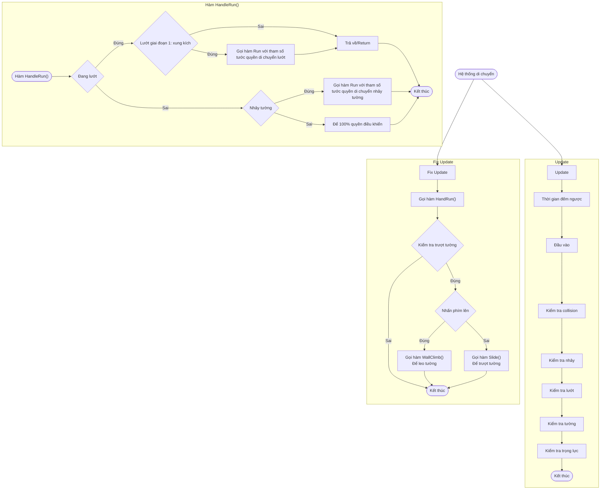

```mermaid
graph TD
    S_Start([Hệ thống di chuyển])

    S_Start --> U_Update
    S_Start --> F_FixedUpdate

    subgraph GroupUpdate ["Update"]
        U_Update[Update]
        U_Timer[Thời gian đếm ngược]
        U_Input[Đầu vào]
        U_Col[Kiểm tra collision]
        U_Jump[Kiểm tra nhảy]
        U_Dash[Kiểm tra lướt]
        U_Wall[Kiểm tra tường]
        U_Grav[Kiểm tra trọng lực]
        U_End([Kết thúc])

        U_Update --> U_Timer
        U_Timer --> U_Input
        U_Input --> U_Col
        U_Col --> U_Jump
        U_Jump --> U_Dash
        U_Dash --> U_Wall
        U_Wall --> U_Grav
        U_Grav --> U_End
    end

    subgraph GroupFixedUpdate ["Fix Update"]
        F_FixedUpdate[Fix Update]
        F_CallRun["Gọi hàm HandRun() "]
        F_CheckWallSlide{Kiểm tra trượt tường}
        F_CheckUp{Nhấn phím lên}
        F_CallClimb["Gọi hàm WallClimb()<br>Để leo tường"]
        F_CallSlide["Gọi hàm Slide()<br>Để trượt tường"]
        F_End([Kết thúc])

        F_FixedUpdate --> F_CallRun
        F_CallRun --> F_CheckWallSlide
        F_CheckWallSlide -- Đúng --> F_CheckUp
        F_CheckWallSlide -- Sai --> F_End
        F_CheckUp -- Đúng --> F_CallClimb
        F_CheckUp -- Sai --> F_CallSlide
        F_CallClimb --> F_End
        F_CallSlide --> F_End
    end

    subgraph GroupHandleRun ["Hàm HandleRun()"]
        HR_Start(["Hàm HandleRun()"])
        HR_CheckDash{Đang lướt}
        HR_CheckPhase1{"Lướt giai đoạn 1: xung kích"}
        HR_DashRun[Gọi hàm Run với tham số tước quyền di chuyển lướt]
        HR_Return[Trả về/Return]
        HR_CheckWallJump{Nhảy tường}
        HR_WallRun[Gọi hàm Run với tham số tước quyền di chuyển nhảy tường]
        HR_FullControl[Để 100% quyền điều khiển]
        HR_End([Kết thúc])

        HR_Start --> HR_CheckDash
        HR_CheckDash -- Đúng --> HR_CheckPhase1
        HR_CheckDash -- Sai --> HR_CheckWallJump
        HR_CheckPhase1 -- Đúng --> HR_DashRun
        HR_CheckPhase1 -- Sai --> HR_Return
        HR_DashRun --> HR_Return
        HR_Return --> HR_End
        HR_CheckWallJump -- Đúng --> HR_WallRun
        HR_CheckWallJump -- Sai --> HR_FullControl
        HR_WallRun --> HR_End
        HR_FullControl --> HR_End
    end
```
