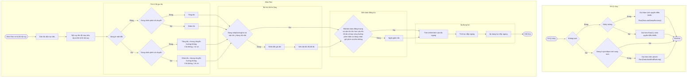

```mermaid
graph TD
    subgraph GroupProcessRun ["Xử lý chạy"]
        PR_Start(["Xử lý chạy"])
        PR_CheckDash{"Không lướt"}
        PR_CheckWallJump{"Nhảy tường"}
        PR_CallLerpWall["Gọi hàm tước quyền điều khiển <br> Run(Data.wallJumpRunLerp)"]
        PR_CallFullControl["Gọi hàm Run(1), toàn quyền điểu khiển"]
        PR_CheckDashEnd{"Đang ở giai đoạn lướt xung kích"}
        PR_CallLerpDash["Gọi hàm hãm phanh Run(Data.dashEndRunLerp)"]
        PR_End(["Kết thúc"])

        PR_Start --> PR_CheckDash
        PR_CheckDash -- Đúng --> PR_CheckWallJump
        PR_CheckDash -- Sai --> PR_CheckDashEnd
        PR_CheckWallJump -- Đúng --> PR_CallLerpWall
        PR_CheckWallJump -- Sai --> PR_CallFullControl
        PR_CallLerpWall --> PR_End
        PR_CallFullControl --> PR_End
        PR_CheckDashEnd -- Đúng --> PR_CallLerpDash
        PR_CheckDashEnd -- Sai --> PR_End
        PR_CallLerpDash --> PR_End
    end

    subgraph GroupRunFunc ["Hàm Run"]
        R_Start(["Hàm Run với tỷ lệ nội suy"])
        R_SetTarget["Gán tốc độ mục tiêu"]
        R_LerpTarget["Nội suy tốc độ mục tiêu dựa trên tỷ lệ nội suy"]

        subgraph GroupCalcAccel ["Tính tỉ lệ gia tốc"]
            CA_CheckGround{"Đang ở mặt đất"}
            CA_CheckInputGround{"Đang nhấn phím di chuyển"}
            CA_AccelGround["Tăng tốc"]
            CA_DecelGround["Giảm tốc"]
            CA_CheckInputAir{"Đang nhấn phím di chuyển"}
            CA_AccelAir["Tăng tốc, nhưng chuyển hướng không.<br>0 là không, 1 là có"]
            CA_DecelAir["Giảm tốc, nhưng chuyển hướng không.<br>0 là không, 1 là có"]
        end

        subgraph GroupHoverComp ["Bù trừ khi lơ lửng"]
            HC_CheckHover{"Đang nhảy/tường/rơi và vận tốc y đang rất nhỏ"}
            HC_DoubleAccel["Nhân đôi gia tốc"]
            HC_ExtMaxSpeed["Kéo dài tốc độ tối đa"]
        end

        subgraph GroupConserveMom ["Bảo toàn động lực"]
            CM_CheckMom{"Bật bảo toàn động lượng và vận tốc lớn hơn vận tốc tối đa và bay cùng hướng phím bấm và đang nhấn giữ phím và trên không"}
            CM_PreventDecel["Ngăn giảm tốc"]
        end

        subgraph GroupApplyForce ["Áp dụng lực"]
            AF_CalcDiff["Tính chênh lệch vận tốc ngang"]
            AF_CalcForce["Tính lực đẩy ngang"]
            AF_ApplyForce["Áp dụng lực đẩy ngang"]
        end

        R_End(["Kết thúc"])

        %% Connections for Run Func
        R_Start --> R_SetTarget
        R_SetTarget --> R_LerpTarget
        R_LerpTarget --> CA_CheckGround

        %% Inside CalcAccel
        CA_CheckGround -- Đúng --> CA_CheckInputGround
        CA_CheckGround -- Sai --> CA_CheckInputAir
        CA_CheckInputGround -- Đúng --> CA_AccelGround
        CA_CheckInputGround -- Sai --> CA_DecelGround
        CA_CheckInputAir -- Đúng --> CA_AccelAir
        CA_CheckInputAir -- Sai --> CA_DecelAir

        %% Connect to HoverComp
        CA_AccelGround --> HC_CheckHover
        CA_DecelGround --> HC_CheckHover
        CA_AccelAir --> HC_CheckHover
        CA_DecelAir --> HC_CheckHover

        %% Inside HoverComp
        HC_CheckHover -- Đúng --> HC_DoubleAccel
        HC_CheckHover -- Sai --> CM_CheckMom
        HC_DoubleAccel --> HC_ExtMaxSpeed

        %% Connect to ConserveMom
        HC_ExtMaxSpeed --> CM_CheckMom

        %% Inside ConserveMom
        CM_CheckMom -- Đúng --> CM_PreventDecel
        CM_CheckMom -- Sai --> AF_CalcDiff

        %% Connect to ApplyForce
        CM_PreventDecel --> AF_CalcDiff

        %% Inside ApplyForce
        AF_CalcDiff --> AF_CalcForce
        AF_CalcForce --> AF_ApplyForce

        %% To End
        AF_ApplyForce --> R_End
    end
```
