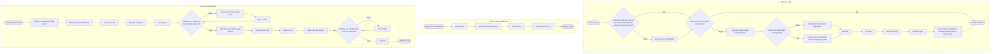

```mermaid
graph TD
    subgraph GroupCheckDash ["Kiểm tra lướt"]
        CD_Start(["Kiểm tra lướt"])
        CD_CheckRefill{"Không lướt và chưa đầy số lần lướt và chạm đất còn hiệu lực và chưa nạp lướt"}
        CD_CallRefill["Gọi Coroutine: RefillDash"]
        CD_CheckDash{"Còn lượt lướt và nút lướt còn hiệu lực"}
        CD_CallSleep["Gọi hàm Sleep() đóng băng thời gian"]
        CD_CheckInput{"Nhấn phím điều khiển hướng không"}
        CD_DirInput["Hướng lướt: theo phím điều khiển"]
        CD_DirFace["Hướng lướt: theo hướng nhân vật đang quay mặt"]
        CD_OnDash["Bật lướt"]
        CD_OffJump["Tắt nhảy"]
        CD_OffWallJump["Tắt nhảy tường"]
        CD_OffShortJump["Tắt nhảy ngắn"]
        CD_CallStartDash["Gọi Coroutine: StartDash, bắt đầu giai đoạn lướt 1 theo hướng"]
        CD_End(["Kết thúc kiểm tra"])

        CD_Start --> CD_CheckRefill
        CD_CheckRefill -- Đúng --> CD_CallRefill
        CD_CheckRefill -- Sai --> CD_CheckDash
        CD_CallRefill --> CD_CheckDash
        CD_CheckDash -- Đúng --> CD_CallSleep
        CD_CheckDash -- Sai --> CD_End
        CD_CallSleep --> CD_CheckInput
        CD_CheckInput -- Đúng --> CD_DirInput
        CD_CheckInput -- Sai --> CD_DirFace
        CD_DirInput --> CD_OnDash
        CD_DirFace --> CD_OnDash
        CD_OnDash --> CD_OffJump
        CD_OffJump --> CD_OffWallJump
        CD_OffWallJump --> CD_OffShortJump
        CD_OffShortJump --> CD_CallStartDash
        CD_CallStartDash --> CD_End
    end

    subgraph GroupRefillDash ["Nạp lại lướt (RefillDash)"]
        RD_Start(["Nạp lại lướt RefillDash"])
        RD_OnRefill["Bật nạp lướt"]
        RD_Wait["Đợi một khoảng thời gian"]
        RD_OffRefill["Tắt nạp lướt"]
        RD_IncDash["Tăng số lần lướt +1"]
        RD_End(["Kết thúc nạp"])

        RD_Start --> RD_OnRefill
        RD_OnRefill --> RD_Wait
        RD_Wait --> RD_OffRefill
        RD_OffRefill --> RD_IncDash
        RD_IncDash --> RD_End
    end

    subgraph GroupStartDash ["Hàm lướt (StartDash)"]
        SD_Start(["Lướt (Dash method)"])
        SD_ResetTimers["Đặt lại các biến đếm châm chước"]
        SD_SaveTime["Mốc thời gian bắt đầu lướt"]
        SD_DecDash["Trừ số lần lướt"]
        SD_OnImpulse["Bật lướt xung kích"]
        SD_OffGrav["Tắt trọng lực"]
        SD_CheckPhase1{"Giai đoạn 1: xung kích<br>Còn trong thời gian lướt"}
        SD_SetVel["Gán vận tốc theo hướng lướt"]
        SD_Wait1["Chờ 1 frame"]
        SD_EndTime1["Mốc thời gian kết thúc giai đoạn 1"]
        SD_OffImpulse["Tắt lướt xung kích"]
        SD_OnGrav["Bật trọng lực"]
        SD_InstaDecel["Giảm tốc ngay lập tức"]
        SD_CheckPhase2{"Giai đoạn 2: kết thúc lướt<br>Chờ hết quán tính"}
        SD_Wait2["Chờ 1 frame"]
        SD_OffDash["Tắt lướt"]
        SD_End(["Kết thúc lướt"])

        SD_Start --> SD_ResetTimers
        SD_ResetTimers --> SD_SaveTime
        SD_SaveTime --> SD_DecDash
        SD_DecDash --> SD_OnImpulse
        SD_OnImpulse --> SD_OffGrav
        SD_OffGrav --> SD_CheckPhase1

        SD_CheckPhase1 -- Đúng --> SD_SetVel
        SD_SetVel --> SD_Wait1
        SD_Wait1 --> SD_CheckPhase1

        SD_CheckPhase1 -- Sai --> SD_EndTime1
        SD_EndTime1 --> SD_OffImpulse
        SD_OffImpulse --> SD_OnGrav
        SD_OnGrav --> SD_InstaDecel
        SD_InstaDecel --> SD_CheckPhase2

        SD_CheckPhase2 -- Đúng --> SD_Wait2
        SD_Wait2 --> SD_CheckPhase2

        SD_CheckPhase2 -- Sai --> SD_OffDash
        SD_OffDash --> SD_End
    end
```
