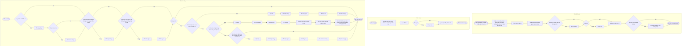

```mermaid
graph TD
    subgraph GroupWallJump ["Hàm WallJump"]
        WJ_Start(["Hàm WallJump() với tham số đầu vào là hướng"])
        WJ_Reset[Đặt các biến đếm châm chước kèm đã nhảy từ tường bên nào về 0 tránh gọi nhiều lần]
        WJ_CalcHoriz[Tính toán lực ngang]
        WJ_ApplyForce[Áp dụng lực theo hướng ngược lại của tường]
        WJ_CheckDir{Hướng di chuyển khác với hướng nhảy}
        WJ_CompHoriz[Bù lực ngang]
        WJ_CheckFall{Đang rơi}
        WJ_CompVert[Bù lực dọc]
        WJ_ApplyInst[Áp dụng lực đẩy tức thì]
        WJ_CheckTurn{Bật quay mặt khi nhảy tường}
        WJ_Turn[Quay mặt nhân vật theo hướng nhảy]
        WJ_End(["Kết thúc hàm WallJump()"])

        WJ_Start --> WJ_Reset
        WJ_Reset --> WJ_CalcHoriz
        WJ_CalcHoriz --> WJ_ApplyForce
        WJ_ApplyForce --> WJ_CheckDir
        WJ_CheckDir -- Đúng --> WJ_CompHoriz
        WJ_CheckDir -- Sai --> WJ_CheckFall
        WJ_CompHoriz --> WJ_CheckFall
        WJ_CheckFall -- Đúng --> WJ_CompVert
        WJ_CheckFall -- Sai --> WJ_ApplyInst
        WJ_CompVert --> WJ_ApplyInst
        WJ_ApplyInst --> WJ_CheckTurn
        WJ_CheckTurn -- Đúng --> WJ_Turn
        WJ_CheckTurn -- Sai --> WJ_End
        WJ_Turn --> WJ_End
    end

    subgraph GroupJump ["Hàm Jump"]
        J_Start(["Hàm Jump()"])
        J_Reset[Đặt các biến đếm châm chước về 0 tránh gọi nhiều lần]
        J_UpForce[Lực đẩy lên]
        J_CheckFall{Đang rơi}
        J_CompVert[Bù lực dọc]
        J_ApplyInst[Áp dụng lực đẩy lên tức thì]
        J_End(["Kết thúc Hàm Jump()"])

        J_Start --> J_Reset
        J_Reset --> J_UpForce
        J_UpForce --> J_CheckFall
        J_CheckFall -- Đúng --> J_CompVert
        J_CheckFall -- Sai --> J_ApplyInst
        J_CompVert --> J_ApplyInst
        J_ApplyInst --> J_End
    end

    subgraph GroupCheckJump ["Kiểm tra nhảy"]
        CJ_Start([Kiểm tra nhảy])
        CJ_CheckJumpFall{Đang nhảy và bắt đầu rơi}
        CJ_OffJump[Tắt đang nhảy]
        CJ_CheckNoWallJump{Không nhảy tường}
        CJ_OnFallAfter[Bật rơi sau nhảy]
        CJ_CheckWallJumpTime{Đang nhảy tường và qua thời gian tước quyền điều khiển}
        CJ_OffWallJump1[Tắt nhảy tường]
        CJ_CheckGround{Chạm đất còn hiệu lực và không nhảy và không nhảy tường}
        CJ_OffShortJump1[Tắt nhảy ngắn]
        CJ_OffFall1[Tắt đang rơi]
        CJ_CheckNoDash{Không lướt}

        CJ_CheckJumpBtn{Đủ điểu kiện nhảy và nút nhảy còn hiệu lực}
        CJ_OnJump1[Bật nhảy]
        CJ_OffWallJump2[Tắt nhảy tường]
        CJ_OffShortJump2[Tắt nhảy ngắn]
        CJ_OffFall2[Tắt đang rơi]
        CJ_CallJump1["Gọi hàm Jump()"]

        CJ_CheckWallJumpBtn{Đủ điểu kiện nhảy tường và nút nhảy còn hiệu lực}
        CJ_OffJump2[Tắt nhảy]
        CJ_OnWallJump[Bật nhảy tường]
        CJ_OffShortJump3[Tắt nhảy ngắn]
        CJ_OffFall3[Tắt đang rơi]
        CJ_SaveTime[Ghi nhớ thời gian lúc nhảy tường]
        CJ_DetTurnDir[Xác định hướng cần quay mặt khi nhảy]
        CJ_CallWallJump["Gọi hàm WallJump() kèm thông số đầu vào [xác định hướng quay mặt]"]

        CJ_CheckDoubleJump{Nút nhảy còn hiệu lực và còn thêm lần nhảy và có thể nhảy đôi}
        CJ_OnJump2[Bật nhảy]
        CJ_OffWallJump3[Tắt nhảy tường]
        CJ_OffShortJump4[Tắt nhảy ngắn]
        CJ_OffFall4[Tắt đang rơi]
        CJ_DecDoubleJump[Trừ 1 thêm lần nhảy]
        CJ_CallJump2["Gọi hàm Jump()"]

        CJ_End([Kết thúc kiểm tra])

        CJ_Start --> CJ_CheckJumpFall
        CJ_CheckJumpFall -- Đúng --> CJ_OffJump
        CJ_CheckJumpFall -- Sai --> CJ_CheckWallJumpTime
        CJ_OffJump --> CJ_CheckNoWallJump
        CJ_CheckNoWallJump -- Đúng --> CJ_OnFallAfter
        CJ_CheckNoWallJump -- Sai --> CJ_CheckWallJumpTime
        CJ_OnFallAfter --> CJ_CheckWallJumpTime

        CJ_CheckWallJumpTime -- Đúng --> CJ_OffWallJump1
        CJ_CheckWallJumpTime -- Sai --> CJ_CheckGround
        CJ_OffWallJump1 --> CJ_CheckGround

        CJ_CheckGround -- Đúng --> CJ_OffShortJump1
        CJ_CheckGround -- Sai --> CJ_CheckNoDash
        CJ_OffShortJump1 --> CJ_OffFall1
        CJ_OffFall1 --> CJ_CheckNoDash

        CJ_CheckNoDash -- Đúng --> CJ_CheckJumpBtn
        CJ_CheckNoDash -- Sai --> CJ_End

        CJ_CheckJumpBtn -- Đúng --> CJ_OnJump1
        CJ_CheckJumpBtn -- Sai --> CJ_CheckWallJumpBtn
        CJ_OnJump1 --> CJ_OffWallJump2
        CJ_OffWallJump2 --> CJ_OffShortJump2
        CJ_OffShortJump2 --> CJ_OffFall2
        CJ_OffFall2 --> CJ_CallJump1
        CJ_CallJump1 --> CJ_End

        CJ_CheckWallJumpBtn -- Đúng --> CJ_OffJump2
        CJ_CheckWallJumpBtn -- Sai --> CJ_CheckDoubleJump
        CJ_OffJump2 --> CJ_OnWallJump
        CJ_OnWallJump --> CJ_OffShortJump3
        CJ_OffShortJump3 --> CJ_OffFall3
        CJ_OffFall3 --> CJ_SaveTime
        CJ_SaveTime --> CJ_DetTurnDir
        CJ_DetTurnDir --> CJ_CallWallJump
        CJ_CallWallJump --> CJ_End

        CJ_CheckDoubleJump -- Đúng --> CJ_OnJump2
        CJ_CheckDoubleJump -- Sai --> CJ_End
        CJ_OnJump2 --> CJ_OffWallJump3
        CJ_OffWallJump3 --> CJ_OffShortJump4
        CJ_OffShortJump4 --> CJ_OffFall4
        CJ_OffFall4 --> CJ_DecDoubleJump
        CJ_DecDoubleJump --> CJ_CallJump2
        CJ_CallJump2 --> CJ_End
    end
```
