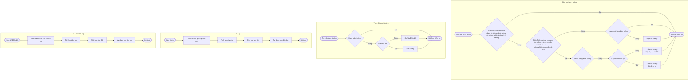

```mermaid
graph TD
    subgraph GroupCheck ["Kiểm tra trượt tường"]
        C_Start(["Kiểm tra trượt tường"])
        C_CheckCond1{"Chạm tường và không nhảy và không nhảy tường và không lướt và đang trên không"}
        C_CheckCond2{"Có thể bám tường và chạm vào tường trái cùng nhấn nút trái hoặc chạm vào tường phải cùng nhấn nút phải"}
        C_CheckCond3{"Đúng và không bám tường"}
        C_OnWall["Bật bám tường"]
        C_CheckCond4{"Sai và đang bám tường"}
        C_CheckGroundTime{"Chạm còn hiệu lực"}
        C_OnGround["Tắt bám tường<br>Bật chạm mặt đất"]
        C_OnFall["Tắt bám tường<br>Bật đang rơi"]
        C_End(["Kết thúc kiểm tra"])

        C_Start --> C_CheckCond1
        C_CheckCond1 -- Đúng --> C_CheckCond2
        C_CheckCond1 -- Sai --> C_End
        C_CheckCond2 -- Đúng --> C_CheckCond3
        C_CheckCond2 -- Sai --> C_CheckCond4
        C_CheckCond3 -- Đúng --> C_OnWall
        C_CheckCond3 -- Sai --> C_End
        C_OnWall --> C_End
        C_CheckCond4 -- Đúng --> C_CheckGroundTime
        C_CheckGroundTime -- Đúng --> C_OnGround
        C_CheckGroundTime -- Sai --> C_OnFall
        C_OnGround --> C_End
        C_OnFall --> C_End
    end

    subgraph GroupExec ["Thực thi trượt tường"]
        E_Start(["Thực thi trượt tường"])
        E_CheckWall{"Đang bám tường"}
        E_CheckUp{"Bấm nút lên"}
        E_CallClimb["Gọi WallClimb()"]
        E_CallSlide["Gọi Slide()"]
        E_End(["Kết thúc kiểm tra"])

        E_Start --> E_CheckWall
        E_CheckWall -- Đúng --> E_CheckUp
        E_CheckWall -- Sai --> E_End
        E_CheckUp -- Đúng --> E_CallClimb
        E_CheckUp -- Sai --> E_CallSlide
        E_CallClimb --> E_End
        E_CallSlide --> E_End
    end

    subgraph GroupSlide ["Hàm Slide()"]
        S_Start(["Hàm Slide()"])
        S_CalcDiff["Tính chênh lệch vận tốc dọc"]
        S_CalcForce["Tính lực đẩy dọc"]
        S_LimitForce["GIới hạn lực đẩy"]
        S_ApplyForce["Áp dụng lực đẩy dọc"]
        S_End(["Kết thúc"])

        S_Start --> S_CalcDiff
        S_CalcDiff --> S_CalcForce
        S_CalcForce --> S_LimitForce
        S_LimitForce --> S_ApplyForce
        S_ApplyForce --> S_End
    end

    subgraph GroupClimb ["Hàm WallClimb()"]
        WC_Start(["Hàm WallClimb()"])
        WC_CalcDiff["Tính chênh lệch vận tốc để leo"]
        WC_CalcForce["Tính lực đẩy dọc"]
        WC_LimitForce["GIới hạn lực đẩy"]
        WC_ApplyForce["Áp dụng lực đẩy dọc"]
        WC_End(["Kết thúc"])

        WC_Start --> WC_CalcDiff
        WC_CalcDiff --> WC_CalcForce
        WC_CalcForce --> WC_LimitForce
        WC_LimitForce --> WC_ApplyForce
        WC_ApplyForce --> WC_End
    end
```
