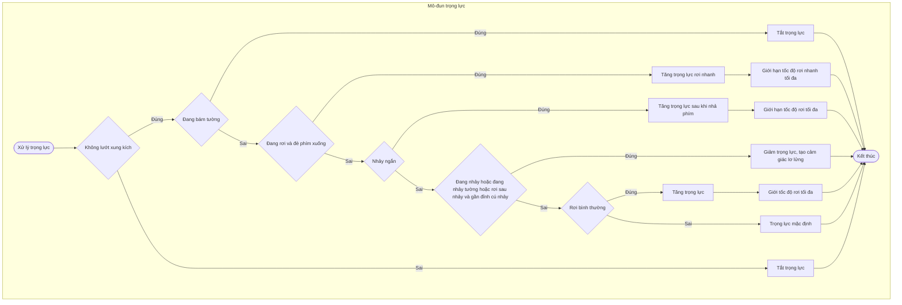

```mermaid
graph TD
    subgraph GroupGravity ["Mô-đun trọng lực"]
        G_Start([Xử lý trọng lực])
        G_CheckDash{Không lướt xung kích}
        G_CheckWall{Đang bám tường}
        G_OffGravityWall[Tắt trọng lực]
        G_CheckFastFall{Đang rơi và đè phím xuống}
        G_IncFastFall[Tăng trọng lực rơi nhanh]
        G_LimitFastFall[Giới hạn tốc độ rơi nhanh tối đa]
        G_CheckShortJump{Nhảy ngắn}
        G_IncShortJump[Tăng trọng lực sau khi nhả phím]
        G_LimitShortJump[Giới hạn tốc độ rơi tối đa]
        G_CheckApex{"Đang nhảy hoặc đang nhảy tường hoặc rơi sau nhảy và gần đỉnh cú nhảy"}
        G_DecApex[Giảm trọng lực, tạo cảm giác lơ lửng]
        G_CheckFall{Rơi bình thường}
        G_IncFall[Tăng trọng lực]
        G_LimitFall[Giới tốc độ rơi tối đa]
        G_DefaultGravity[Trọng lực mặc định]
        G_OffGravityDash[Tắt trọng lực]
        G_End([Kết thúc])

        G_Start --> G_CheckDash
        G_CheckDash -- Đúng --> G_CheckWall
        G_CheckDash -- Sai --> G_OffGravityDash
        G_CheckWall -- Đúng --> G_OffGravityWall
        G_CheckWall -- Sai --> G_CheckFastFall
        G_CheckFastFall -- Đúng --> G_IncFastFall
        G_IncFastFall --> G_LimitFastFall
        G_CheckFastFall -- Sai --> G_CheckShortJump
        G_CheckShortJump -- Đúng --> G_IncShortJump
        G_IncShortJump --> G_LimitShortJump
        G_CheckShortJump -- Sai --> G_CheckApex
        G_CheckApex -- Đúng --> G_DecApex
        G_CheckApex -- Sai --> G_CheckFall
        G_CheckFall -- Đúng --> G_IncFall
        G_IncFall --> G_LimitFall
        G_CheckFall -- Sai --> G_DefaultGravity

        G_OffGravityWall --> G_End
        G_LimitFastFall --> G_End
        G_LimitShortJump --> G_End
        G_DecApex --> G_End
        G_LimitFall --> G_End
        G_DefaultGravity --> G_End
        G_OffGravityDash --> G_End
    end
```
